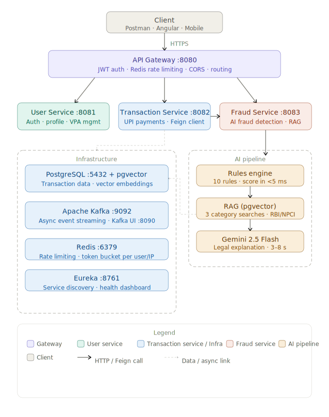

<div align="center">

# 🛡️ UPI Fraud Shield AI

**Production-grade UPI transaction fraud detection backend**

Built with Java Spring Boot microservices, a three-layer AI pipeline, and real RBI/NPCI regulatory documents as the knowledge base.

[](https://openjdk.org/projects/jdk/21/)
[](https://spring.io/projects/spring-boot)
[](https://spring.io/projects/spring-ai)
[](https://ai.google.dev/)
[](LICENSE)

</div>

---

## 🔍 What Makes This Different

Most fraud detection systems return a binary flag or a risk score. **UFSAI returns a structured, legally-grounded explanation** generated by Gemini and anchored in real RBI and NPCI circulars retrieved via RAG:

```
WHY FLAGGED:
  This ₹82,000 transaction was blocked because the amount exceeds the
  ₹50,000 enhanced due diligence threshold per RBI Master Direction on
  Fraud Risk Management 2024 (Clause 8.3), and was initiated from an
  unregistered device — a pattern consistent with SIM swap account
  takeover fraud.

YOUR RIGHTS:
  Under RBI Customer Protection Circular 2017
  (DBR.No.Leg.BC.78/09.07.005/2017-18), you have zero liability if you
  report within 3 working days. Your bank must credit the disputed amount
  within 10 working days of your complaint.

WHAT TO DO NOW:
  Call 1930 (National Cybercrime Helpline, 24×7) immediately and file a
  complaint at cybercrime.gov.in. Raise a UPI chargeback with your bank —
  under NPCI OC-198 the bank must resolve within 15 business days.
```

---

## 🏗️ Architecture



---

## 🧰 Tech Stack

| Layer | Technology |
|---|---|
| Language | Java 21 |
| Framework | Spring Boot 3.5, Spring Cloud 2024 |
| AI / LLM | Spring AI 1.1.4, Google Gemini 2.5 Flash |
| Embeddings | Google `text-embedding-004` (768 dimensions) |
| Vector Store | pgvector on PostgreSQL 16 |
| Messaging | Apache Kafka 7.5 with Kafka UI |
| API Gateway | Spring Cloud Gateway (WebFlux / Netty) |
| Rate Limiting | Redis token bucket — per user and per IP |
| Service Discovery | Netflix Eureka |
| HTTP Clients | Spring Cloud OpenFeign + FallbackFactory |
| Security | JWT (HMAC-SHA256, jjwt 0.12.5) |
| ORM | Spring Data JPA / Hibernate |
| Build | Maven multi-module |
| Containers | Docker Compose |

---

## 🚨 Fraud Detection — 10 Rules

The rules engine evaluates all 10 rules independently per transaction. Scores are summed and capped at 1.0.

| Rule | Score | Condition |
|---|---|---|
| `RULE_HIGH_AMOUNT` | +0.35 | Amount > ₹50,000 |
| `RULE_VELOCITY_5MIN` | +0.40 | 3+ transactions in 5 minutes |
| `RULE_VELOCITY_1HR` | +0.30 | 10+ transactions in 1 hour |
| `RULE_DAILY_LIMIT` | +0.45 | Daily total > ₹2,00,000 |
| `RULE_ODD_HOURS` | +0.20 | Transaction between 1 AM and 4 AM |
| `RULE_NEW_DEVICE` | +0.25 | Unregistered device ID |
| `RULE_ROUND_AMOUNT` | +0.15 | Round amount ≥ ₹10,000 |
| `RULE_NEW_RECEIVER` | +0.15 | First payment to this VPA |
| `RULE_MULTIPLE_NEW_VPAS` | +0.30 | 3+ new VPAs paid in 24 hours |
| `RULE_FIRST_HIGH_VALUE` | +0.40 | High amount as first/second ever transaction |

> **Score ≥ 0.70 → 🔴 BLOCK &nbsp;·&nbsp; Score ≥ 0.40 → 🟡 FLAG &nbsp;·&nbsp; Score < 0.40 → 🟢 ALLOW**

---

## 📚 Knowledge Base — Real Regulatory Documents

The RAG pipeline retrieves from **14 document chunks** across three categories sourced from actual RBI and NPCI circulars.

**Category 1 — Why Flagged** *(fraud detection rules and thresholds)*
- RBI Master Direction on Fraud Risk Management — July 2024
- RBI Master Direction on Digital Payment Security Controls — 2021
- NPCI UPI Operating Circular OC-190 — March 2024

**Category 2 — Customer Liability** *(rights after fraud)*
- RBI Customer Protection Circular — July 2017
- RBI Integrated Ombudsman Scheme — November 2021

**Category 3 — Next Steps** *(what to do after fraud)*
- NPCI UPI OC-184 — Chargeback Rules and Procedures — 2023
- NPCI UPI OC-198 — Revision of Disputes TAT — 2024
- NPCI UPI OC-213 — Auto Acceptance of Chargeback — 2025

> Three separate similarity searches run per transaction (one per category), ensuring the LLM always receives fraud rules, customer liability, and next-steps context — regardless of which is semantically closest to the transaction.

---

## 📁 Project Structure

```
upifraudshieldai/
├── architecture.svg
├── docker-compose.yml
├── .env.example
├── .gitignore
├── pom.xml                                         # Maven multi-module root
├── README.md
│
├── eureka-server/                                  # Service registry  :8761
│   └── src/main/java/com/priyanshu/
│       └── upifraudshieldai/eureka/
│           └── EurekaServerApplication.java
│
├── api-gateway/                                    # Single entry point  :8080
│   └── src/main/java/com/priyanshu/
│       └── upifraudshieldai/gateway/
│           ├── config/                             # Route config, CORS, Redis key resolvers
│           ├── exception/                          # JSON error handler
│           ├── filter/                             # JwtAuthGatewayFilterFactory
│           └── ApiGatewayApplication.java
│
├── user-service/                                   # Auth & profile  :8081
│   └── src/main/java/com/priyanshu/
│       └── upifraudshieldai/user/
│           ├── config/                             # Security, JWT config
│           ├── controller/                         # AuthController, UserController
│           ├── dto/
│           ├── entity/                             # User, UpiVpa
│           ├── exception/
│           ├── kafka/                              # UserEventPublisher
│           ├── repository/
│           ├── security/
│           ├── service/                            # UserService (lockout, VPA logic)
│           └── UserServiceApplication.java
│
├── transaction-service/                            # UPI payments  :8082
│   └── src/main/java/com/priyanshu/
│       └── upifraudshieldai/transaction/
│           ├── client/                             # FraudServiceClient + FallbackFactory
│           ├── config/
│           ├── controller/
│           ├── dto/
│           ├── entity/                             # Transaction (full lifecycle)
│           ├── exception/
│           ├── kafka/                              # TransactionEventPublisher
│           ├── repository/
│           ├── security/
│           ├── service/                            # TransactionService
│           └── TransactionServiceApplication.java
│
└── fraud-service/                                  # AI fraud detection  :8083
    └── src/main/java/com/priyanshu/
        └── upifraudshieldai/fraud/
            ├── config/
            ├── controller/
            ├── dto/
            ├── entity/
            ├── exception/
            ├── kafka/
            ├── repository/
            ├── rules/                              # FraudRulesEngine (10 rules)
            ├── service/                            # FraudAnalysisService, RagService,
            │                                       # ExplanationService, KnowledgeBaseService
            └── FraudServiceApplication.java
```

---

## 🚀 Getting Started

### Prerequisites

- Java 21+
- Spring Boot 3.5.12
- Spring AI 1.1.4
- Maven 3.9+
- Docker Desktop
- Free Gemini API key from [Google AI Studio](https://aistudio.google.com/apikey)

### 1. Clone and Configure

```bash
git clone https://github.com/Priyanshu-Gupta-24/upi-fraud-shield-ai.git
cd upi-fraud-shield-ai

cp .env.example .env
# Edit .env — add your GEMINI_API_KEY
```

### 2. Start Infrastructure

```bash
docker compose up -d

# Enable pgvector extension
docker exec -it upifraudshieldai-postgres psql -U user -d upifraudshieldai_db \
  -c 'CREATE EXTENSION IF NOT EXISTS vector;'
```

### 3. Set the Gemini API Key in IntelliJ

```
Run → Edit Configurations → FraudServiceApplication
→ Environment Variables → GEMINI_API_KEY=your-key-here
```

### 4. Start Services in Order

```
1. EurekaServerApplication       :8761
2. UserServiceApplication        :8081
3. TransactionServiceApplication :8082
4. FraudServiceApplication       :8083   
5. ApiGatewayApplication         :8080
```

On fraud-service startup you will see:
```
Starting RBI/NPCI knowledge base ingestion...
Knowledge base ingestion complete: 14 source docs → ~40 chunks
```

### 5. Verify Everything is Running

| URL | Expected |
|---|---|
| `http://localhost:8761` | Eureka dashboard — all 4 services registered |
| `http://localhost:8090` | Kafka UI — topics visible |
| `http://localhost:8080/api/auth/health` | `{"status":"UP"}` |

---

## 📡 API Quick Reference

All requests go through the gateway at `http://localhost:8080`.

### Register and Login

```bash
# Register
curl -X POST http://localhost:8080/api/auth/register \
  -H "Content-Type: application/json" \
  -d '{"username":"demo","email":"demo@example.com","password":"password123",
       "fullName":"Demo User","phoneNumber":"9876543210","deviceId":"device-001"}'

# Login — copy the token from the response
curl -X POST http://localhost:8080/api/auth/login \
  -H "Content-Type: application/json" \
  -d '{"usernameOrEmail":"demo","password":"password123"}'
```

### Create a Normal Transaction (ALLOW)

```bash
curl -X POST http://localhost:8080/api/transactions \
  -H "Authorization: Bearer <TOKEN>" \
  -H "Content-Type: application/json" \
  -d '{"userId":"<USER_ID>","senderVpa":"demo@okaxis",
       "receiverVpa":"merchant@ybl","amount":500.00,
       "transactionType":"P2P","deviceId":"device-001","location":"Mumbai"}'
```

### Trigger Fraud Detection (BLOCK)

```bash
curl -X POST http://localhost:8080/api/transactions \
  -H "Authorization: Bearer <TOKEN>" \
  -H "Content-Type: application/json" \
  -d '{"userId":"<USER_ID>","senderVpa":"demo@okaxis",
       "receiverVpa":"unknown@paytm","amount":85000.00,
       "transactionType":"P2P","deviceId":"new-unknown-device","location":"Unknown"}'
```

**Expected response:**
```json
{
  "status": "BLOCKED",
  "isFraud": true,
  "fraudScore": 0.75,
  "rulesTriggered": "RULE_HIGH_AMOUNT,RULE_NEW_DEVICE,RULE_NEW_RECEIVER,RULE_FIRST_HIGH_VALUE",
  "fraudExplanation": "WHY FLAGGED: ... YOUR RIGHTS: ... WHAT TO DO NOW: ..."
}
```

---

## 🔌 Port Reference

| Service | Port | Access |
|---|---|---|
| API Gateway | 8080 | All client requests go here |
| User Service | 8081 | Direct (dev / testing only) |
| Transaction Service | 8082 | Direct (dev / testing only) |
| Fraud Service | 8083 | Direct (dev / testing only) |
| Eureka Dashboard | 8761 | Browser |
| Kafka UI | 8090 | Browser |
| PostgreSQL | 5432 | psql / pgAdmin |
| Redis | 6379 | redis-cli |

---

## 💡 Key Design Decisions

**Why three RAG searches instead of one?**
A single similarity search always returns the top-K chunks closest to the transaction description — which are always fraud detection documents. Customer liability and next-steps documents are semantically farther from transaction text and never appear in a combined search. Three targeted searches with different vocabulary guarantee all three categories are always represented in the LLM prompt, making explanations complete every time.

**Why rules engine before LLM?**
The rules engine runs in under 5ms. If no rules fire, the RAG + Gemini pipeline is skipped entirely. This means clean transactions — the vast majority of real UPI payments — cost zero Gemini API tokens and respond in under 10ms. Only suspicious transactions pay the 3–8 second LLM latency.

**Why FallbackFactory instead of Fallback?**
`FallbackFactory` receives the actual exception including Eureka lookup failures when fraud-service is not yet registered. A plain `Fallback` class only activates after the circuit breaker opens, requiring the service to have previously failed multiple times. The factory approach means transactions never get stuck as `FAILED` regardless of fraud-service state.

**Why hardcoded document chunks instead of live PDF fetching?**
The hardcoded strings are the most retrieval-relevant excerpts from each document, already structured for semantic search. Live PDF fetching adds network dependency on RBI/NPCI URLs (which change) and produces raw OCR text that needs post-processing. The current approach is faster, more reliable, and produces better RAG quality.

---

## 🔑 Environment Variables

| Variable | Service | Notes |
|---|---|---|
| `GEMINI_API_KEY` | fraud-service | Free key from [aistudio.google.com](https://aistudio.google.com/apikey) |
| `jwt.secret` | user, transaction, gateway | Must be identical across all three — replace the demo placeholder for production |

See `.env.example` for the complete list.

---

## 📄 License

MIT — see [LICENSE](LICENSE)
